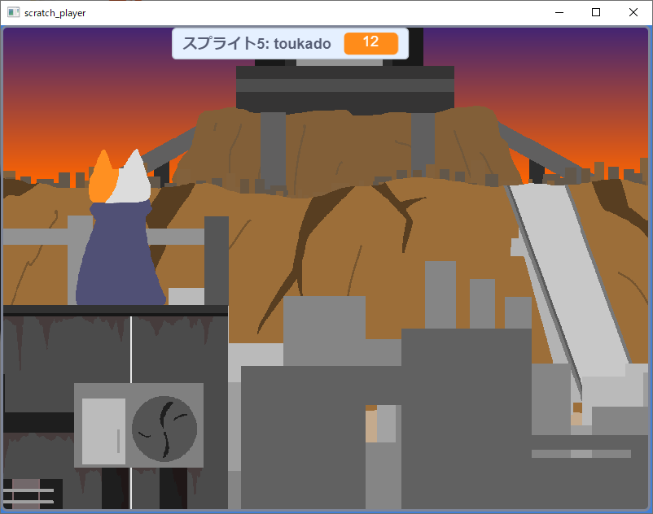

© Buff0335
# Scratch Player
Scratchで制作したプロジェクトを良さげにexeで実行するツールです

# ダウンロード
[ダウンロード](https://github.com/PenguinCabinet/scratch-player/releases/latest)


# 使い方
コマンドライン引数でプロジェクトURLをいれてください
```shell
scratch_player https://scratch.mit.edu/projects/602579945 
```

# TODO
* オフラインでの実行版
* Linux、Mac版